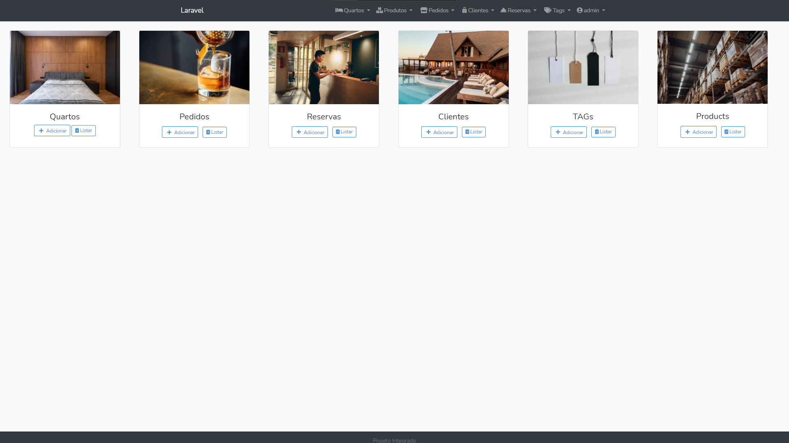
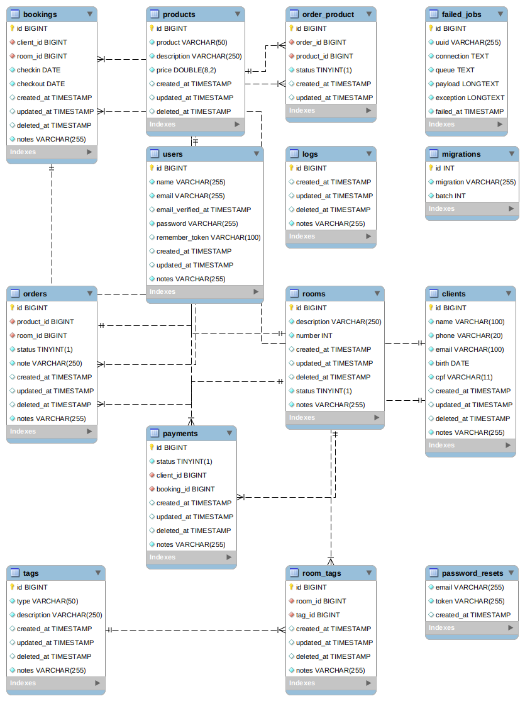
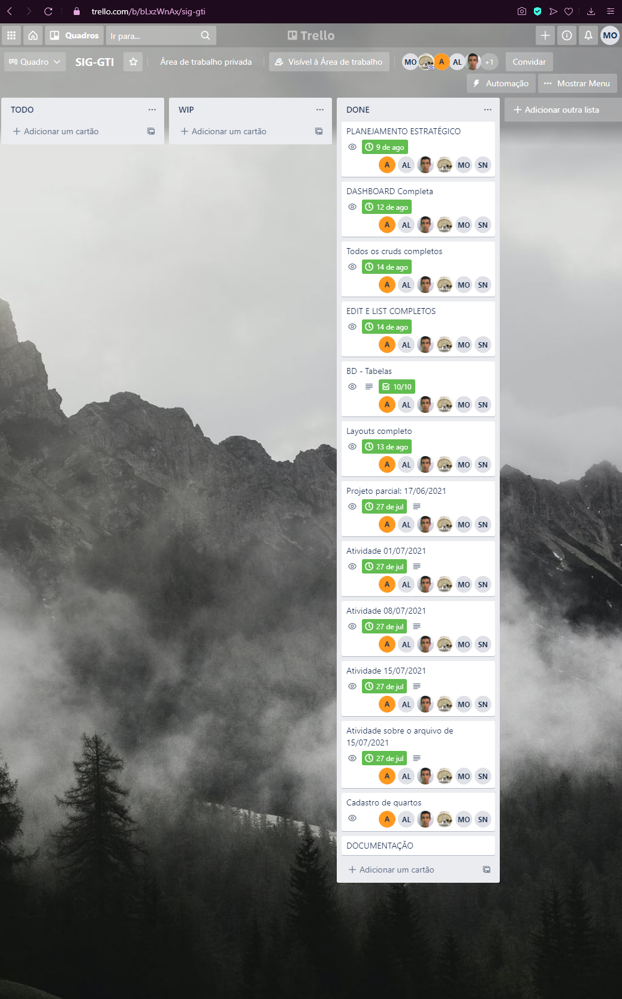
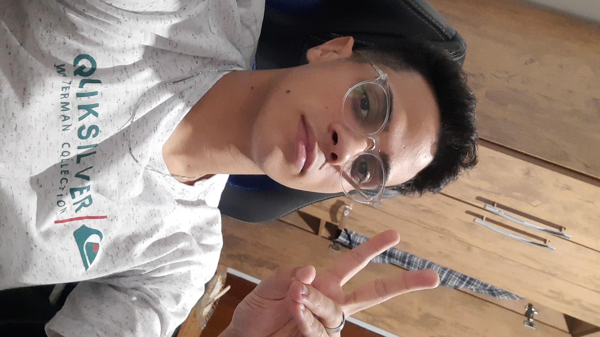

    <h1 align="center"> Sistema Hotelaria</h1>

Projeto Integrado

  <i>“Um sistema para proprietários de grandes hospedarias”</i>

## 🖼️ Preview

## 🧰 instalação

  
🐋 Instação por Docker

   <b>[DESCONTINUADO]</b>

  
📦 Instação por Laravel

   

  <h2>Pré requisistos</h2>

  * Ambiente Laravel preparado
  * Banco de dados MySQL/MariaDB porta <b> 3306 </b>

  <h2>Instalação</h2>

  <h3> Faça o clone do repositório </h3>

  <code> git clone https://github.com/AlexBLeonel/projeto-integrado.git </code>
  
  <h3> Vá para o container </h3>

  <code> cd container </code>

  <h3> Inicie o Banco de dados Mysql </h3>

  <b> Windows </b>

  <code> mysqld.exe </code>

  <b> Linux </b>

  <code> sudo /etc/init.d/mysql start </code>

  <h3> Inicie o App </h3>

  <code> php artisan serve </code>

  <h3> Vá para o navegador e acesse </h3>
  <a href="http://localhost:8000">localhost:8000</a>

<h2>📁 Schema Banco de Dados</h2>

  
mostrar BD

   
   

<h2>📊 Desenvolvimento do projeto </h2>

  
mostrar kanban

   
   

## 🛠️ Desenvolvedores

| 📷                                                                                          | Desenvolvedor                                    | Prontuário |
| ----------                                                                                  | -----------------------------------------------   | ---------- |
|                                 | [@AlexBLeonel](https://github.com/AlexBLeonel)    | CG3003094  |
|  | [@diegolopes](https://github.com/diegolopes)      | CG3004023  |
|  | [@kaueMarques](https://github.com/kaueMarques)    | CG300399X  |
|              | [@MatheusFelipe](https://github.com/SlackxRA1D)   | CG3004732  |
|                                  | [@AnaLuiza](https://github.com/)                  | CG3003094  |
|                               | [@SamuelFrank](https://github.com/)               | CG3002861  |
